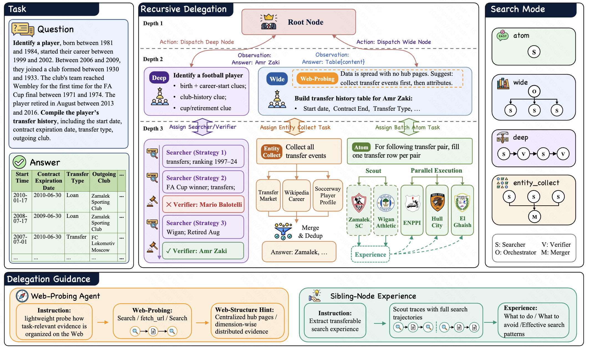

# WebSwarm Overview

**WebSwarm: Recursive Multi-Agent Orchestration for Deep-and-Wide Web Search**

WebSwarm is a multi-agent framework for complex web search that builds its plan as it goes. Instead of fixing a subtask breakdown up front, a root agent spawns search nodes on the fly — each node gets a local goal plus a **search mode** that decides how it works. A node can either solve its goal directly or delegate child nodes, then pass evidence back up so parent nodes can expand, revise, or aggregate. This lets the search tree grow recursively as new clues appear, handling depth and breadth in one process.

## Code Release Status

The code is currently under internal review and approval. We expect to release the runnable implementation within one week. Once the approval process is complete, this repository will be updated with source code, setup instructions, benchmark configuration details, and reproduction scripts.
